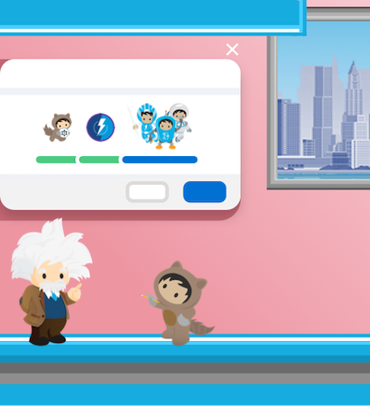
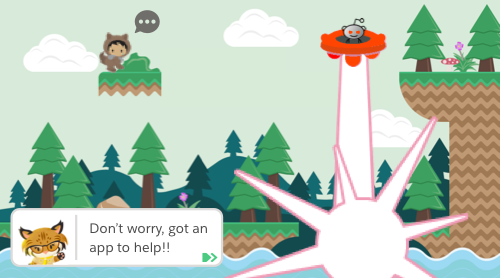

# Trails-Traverser All-Star

### Story
A mysterious organization has kidnapped your alien friend and cloned them into an army of zombies to take over the world. It's up to you to collect the map orbs to traverse the treacherous trails, rescue your friend, and save the world!

### Concept Art

#### Creative Commons

This work is licensed under a [Creative Commons Attribution-NonCommercial 4.0 International License.](http://creativecommons.org/licenses/by-nc/4.0/)

"Trails-Traverser All-Star", was crafted under the guidance of the mozilla tutorial, "HTML5 Games Workshop" by Belén "Benko" Albeza" [@ladybenko](https://twitter.com/ladybenko)

- Character mascot designs are by Salesforce, Github, and Reddit
- Background stock-music is from [Memoraphile @ You're Perfect Studio](https://opengameart.org/content/gone-fishin)
